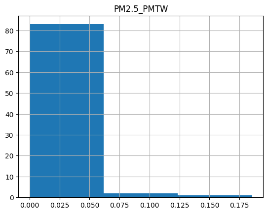
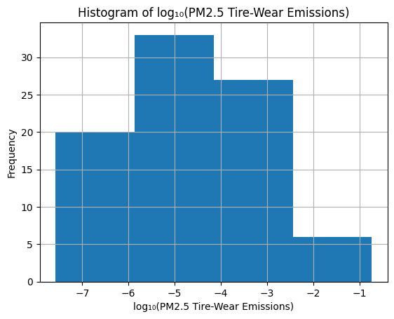
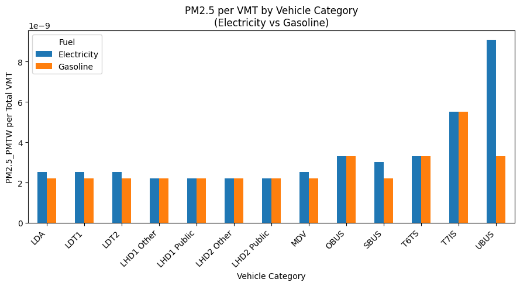
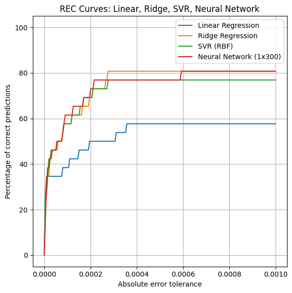
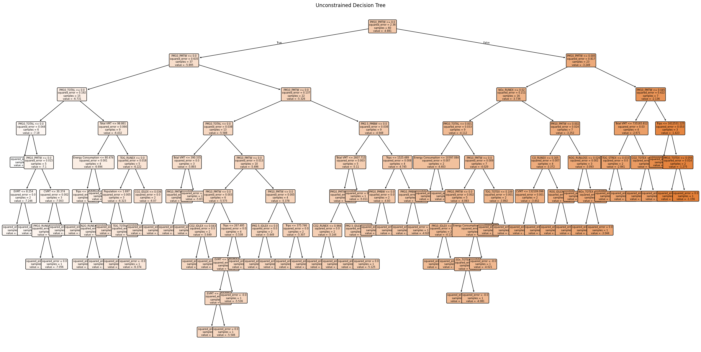
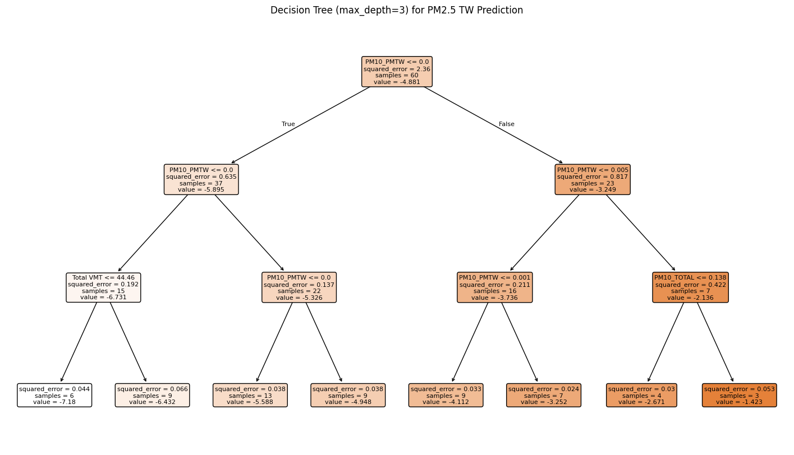
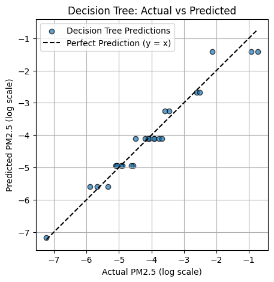
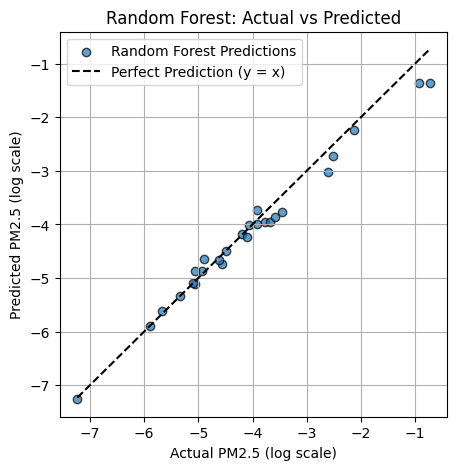
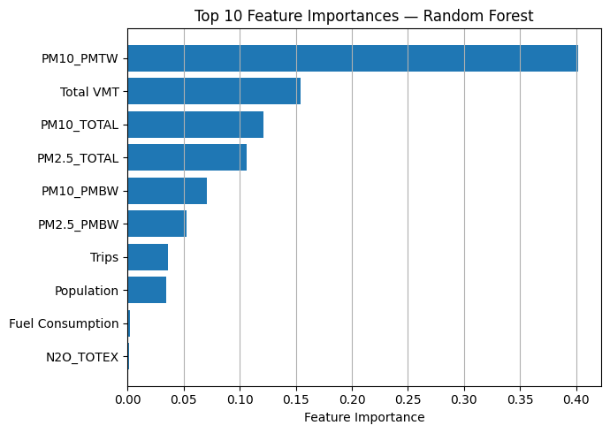

## My Project

I applied machine learning techniques to investigate PM2.5 (particulate matter of 2.5μm or less) TW (tire wear) emissions that vehicles release. 

***

## 1. Introduction 

Electric vehicles (EVs) are often described as “zero-emission vehicles,” a label that plays a central role in climate policy and public perception. When our club team first began this project through UCLA’s International Urban Sustainability Student Corps (IUSSC) in partnership with the California Air Resources Board (CARB), we shared that same assumption. If EVs eliminate tailpipe pollution, then transitioning to them should automatically reduce particulate matter exposure in cities like Los Angeles. As we dug deeper, we learned that this may not be the case.

While EVs eliminate tailpipe emissions, they still produce pollution from non-exhaust sources, particularly tire and brake wear. These forms of PM2.5 (particulate matter of 2.5μm or less) enter the air regardless of whether a car runs on gasoline or electricity. This becomes especially important when considering that EVs are, on average, about 20 percent heavier than comparable gasoline vehicles due to their batteries. That added weight increases friction and stress on tires, which in turn leads to higher levels of tire-wear particles. As Los Angeles accelerates its transition to electric vehicles, understanding the implications of these overlooked emissions is becoming increasingly urgent.

With the current context of research in non-exhaust emissions of tire wear, there are many complications that arise when exploring this field. Throughout the 850 peer-reviewed scientific publications that were analyzed about tire wear emissions, the current knowledge base on tire wear emissions is scattered [1]. There are varying measurement methodologies that one approaches, but there are also many explanatory variables that affect the amount of tire wear emissions that cannot be fully controlled in a highly advanced laboratory setting.

To explore this issue with acknowledgement of the current research field, we turned to CARB’s EMFAC emissions model, focusing specifically on tire-wear PM2.5 in Los Angeles County. We performed machine learning to understand how to predict PM2.5 TW given other explanatory variables. Through the AOS C111 class, I plan to achieve the objectives of this research in threefold: (1) develop machine learning models for predicting PM2.5 emissions from tire wear using vehicle and driving behavior patterns, (2) compare multiple algorithm classes using k-fold cross-validation and REC curves, and (3) identify the most accurate and stable modeling framework for non-exhaust PM2.5 TW prediction. By utilizing ensemble learning methods, this study seeks to advance predictive modeling in non-exhaust emissions and contribute to the broader adoption of data-driven approaches in the clean energy transportation sector. This machine learning project will support the club's research throughout the school year as we begin conducting case studies with in-field observations on tire-wear emissions.

## 2. Data

The EMFAC (Emission Factors) model is an on-road mobile emissions model developed by the California Air Resources Board (CARB). EMFAC is used to support public policy and regulatory decision-making and is also publicly available for research and planning purposes. In this study, we investigate differences between gasoline and electric vehicles to understand how PM₂.₅ tire-wear (TW) emissions can be predicted across these categories.

Initially, the dataset contained n = 13 gasoline vehicles and n = 41 electric vehicles, indicating a substantial class imbalance. To address this sampling gap, natural gas vehicles (n = 29) were reclassified under the gasoline vehicle category. This pre-processing step was implemented to achieve a more approximately balanced sample between the gasoline and electric vehicle groups, improving the statistical reliability of subsequent modeling. Now, there is a total of n = 83 vehicles that we are investigating. 

We next developed a visualization to examine the distribution of PM2.5 TW values within the EMFAC dataset. From initial observations, the distribution is highly right-skewed, with the majority of PM2.5 TW values concentrated at the lower end of the metric range. This concentration indicates that most vehicles exhibit relatively low PM2.5 TW emissions, with only a small number producing substantially higher values. This distribution is illustrated in Figure 1.

*Figure 1: Pre-Processed PM2.5 TW Data of EMFAC [1].*

To improve the normality of the response variable, a logarithmic transformation was applied to the PM2.5 tire-wear (TW) values. This transformation reduces the influence of extreme values and mitigates the strong right-skew observed in the original distribution, resulting in data that are better appropriate for regression-based and machine learning models. The resulting transformed distribution is shown in Figure 2.

Within the dataset, there are many variables to determine if there is any impact on the predictions of PM2.5 TW. 

*Figure 2: Post-Processed PM2.5 TW Data of EMFAC through Logarithmic Transformation  [2].*

With the data now normalized through the logarithmic transformation, PM2.5 tw can be analyzed more effectively within the modeling framework. Before proceeding further, it is important to examine how the behavior of PM2.5 TW is represented within the emissions modeling data. In this field of research, PM2.5 TW is often evaluated per vehicle miles traveled (VMT) to quantify the rate at which tire-wear particles are emitted over time and distance.

By incorporating machine learning to predict PM2.5 TW, we aim to evaluate whether electric vehicles exhibit a higher PM2.5 TW emission rate per VMT compared to gasoline vehicles, a hypothesis motivated by differences in vehicle mass and torque. Figure 3 presents a bar chart comparison between electric and gasoline vehicles, highlighting a key methodological change between the EMFAC 2021 and EMFAC 2025. The EMFAC 2025 model incorporates vehicle weight dependence, whereas the EMFAC 2021 model treated tire-wear emissions as weight-independent; hence, the PM2.5 TW emission rate per VMT between gasoline and electric vehicles was the same.

However, it is important to note that the EMFAC dataset may contain inherent multicollinearity due to correlated traffic and emissions variables. For example, PM2.5 Total is  related to PM2.5 TW emissions and may artificially inflate feature importance if included directly as a predictor. To accommodate this multicollinearity, care was therefore taken to assess feature redundancy and ensure that predictive relationships were not dominated by trivially correlated variables.

*Figure 3: PM2.5 per VMT Bar Chart Comparison Between Electric and Gasoline Vehicles EMFAC 2025 [3].*

## 3. Modeling

For this project, the main purpose of the investigation is to test some modeling algorithms that would best fit the dataset. I will be testing linear regression, ridge regression, neural network, random forest,  regression, and simple vector regression (SVR). These methods are all commonly used in machine learning that help with quantitative predictions of the response variables, given extensive information about the explanatory variables. Each of these approaches has its own strengths and weaknesses, so I will test the accuracy of each algorithm. 

The data was first split between training and testing data using a 70-30 ratio. With a test size of 30%, the models were set to use 70% of the data for training the model, and the remaining 30% will be used for evaluating the model's performance on data it has not seen before. 

_Figure 4. Illustration of stacking. Source: Analytics Vidhya (2020)._

To evaluate model performance, we implemented Regression Error Characteristic (REC) curves, which provide a quantitative assessment of the fraction of predictions that fall within a specified error tolerance of 0.001 for the log-transformed PM2.5 TW. The REC curve offers a comprehensive view of prediction accuracy across varying error thresholds.

In addition to REC analysis, standard regression metrics including the coefficient of determination (R²) and root mean squared error (RMSE) were computed to quantify predictive accuracy. To further validate model behavior, predicted values were plotted against true target values to assess agreement and verify consistency with the REC trends.

After developing all the models for this project, a k-fold cross-validation was performed with the same model architecture/hyperparameters evaluated on different sets of test data points, so there can be an understanding of how much the model performance varies based on random train/test splitting. This is useful by having a standardized comparison of different models with a finite amount of available data to work with.

### 3.1 Linear Regression

Linear regression was selected as an initial baseline model due to its widespread use in quantitative prediction tasks and its interpretability. Based on prior literature, it was reasonable to first test the assumption that PM2.5 tire-wear emissions exhibit an approximately linear relationship with key explanatory variables. In this study, linear regression models the logarithmically transformed PM2.5 TW as a linear combination of trip characteristics, total vehicle miles traveled (VMT), and fuel consumption. This formulation assumes that changes in these driving and vehicle-related variables produce proportional changes in log-transformed PM2.5 TW. Figure 5 shows the REC curve for the linear regression model, showing that about 60% of points are well-predicted. Figure 11 shows the k-fold cross-validation of linear regression with respect to the other model, ranking as the lowest with high RMSE and low R² scores. 

### 3.2 Ridge Regression

To improve upon the linear regression baseline, ridge regression was incorporated to address multicollinearity among the predictor variables inherent in the EMFAC dataset. By introducing an L2 regularization penalty, ridge regression shrinks coefficient magnitudes and reduces variance in the parameter estimates, reducing overfitting while stabilizing model predictions for PM2.5 TW emissions. Figure 5 shows the REC curve for the ridge regression model, showing that about 80% of points are well-predicted. Figure 11 shows the k-fold cross-validation of ridge regression with respect to the other models, ranking on the lower end with high RMSE and low R² scores. 

### 3.3 Neural Network

Neural networks are flexible nonlinear machine learning models inspired by the structure of biological neural systems, consisting of interconnected layers of artificial neurons that transform input features through weighted connections and nonlinear activation functions.  Given the nonlinear nature of PM2.5 TW and the strong multicollinearity inherent in the EMFAC dataset, neural networks were considered appropriate for capturing intricate interaction effects among driving behavior and vehicle characteristics. Figure 5 shows the REC curve for the neural network model, showing that about 80% of points are well-predicted. Figure 11 shows the k-fold cross-validation of the neural network with respect to the other models, ranking on the lower end with high RMSE and low R² scores. 

### 3.4 Random Forest 

Random Forest is an ensemble learning method that constructs a large collection of s using bootstrap. The final prediction is obtained by averaging the predictions across all trees. 

An additional advantage of Random Forest is its ability to quantify feature importance, which provides insight into which driving and vehicle-related variables contribute most strongly to PM2.5 TW predictions. Figure 9 shows the Actual vs. Predicted Y-value curve for the random forest model, showing that most of the predictions follow the perfect prediction behavior. Figure 11 shows the k-fold cross-validation of the random forest model with respect to the other models, ranking on the higher end with low RMSE and high R² scores. 

### 3.5 

s are appropriate for capturing nonlinear relationships and complex feature interactions within a dataset. Because the relationship between the input variables and the logarithmically transformed PM2.5 TW emissions is expected to be highly nonlinear, s provide a flexible modeling framework that does not impose linearity assumptions. 

From a physical science perspective, the hierarchical structure of a model  offers interpretability by allowing researchers to trace how specific driving and vehicle-related variables influence predictions through  conditional splits. In this study, regression trees were used to model the predominantly quantitative feature set, while still allowing categorical variables such as fuel type to be incorporated when applicable. This flexibility makes s well-suited for modeling the complex structure of the PM2.5 TW dataset. Figure 8 shows the Actual vs. Predicted Y-value curve for the  model, showing that most of the predictions follow the perfect prediction behavior. Figure 11 shows the k-fold cross-validation of the  model with respect to the other models, ranking on the higher end with low RMSE and high R² scores. 

### 3.6 SVR

SVR was included as a nonlinear kernel-based method for predicting the PM2.5 TW output. Because SVR can capture nonlinear relationships through kernel functions, it was evaluated as an alternative to tree-based and neural network models for modeling the EMFAC dataset. Figure 5 shows the REC curve for the SVR model, showing that about 80% of points are well-predicted. Figure 11 shows the k-fold cross-validation of the SVR model with respect to the other models, ranking on the moderate end with adequate RMSE and inconclusive R² scores. 

When \(a \ne 0\), there are two solutions to \(ax^2 + bx + c = 0\) and they are
  \[x = {-b \pm \sqrt{b^2-4ac} \over 2a}.\]

## 4. Results

_Figure 5. REC Curve for Linear, Ridge, SVR, and Neural Network_

_Figure 6.  without Constraints_

_Figure 7.  with a maximum depth of 3_

_Figure 8.  Actual vs. True Y-Values_

_Figure 9. Random Forest Actual vs. True Y-Values_

_Figure 10. Feature Importances for Random Forest_

| Index  | Model | RMSE Mean | RMSE Std | R² Mean | R² STD |
| ------ | ------------- | ------------- | ------------- | ------------- | ------------- |
|   1    |  (max_depth = 3)  | 0.272  | 0.055  | 0.966  | 0.011  |
|   5    | Random forest (n_estimators=200, max_depth=6)  | 0.279  | 0.108  | 0.959  | 0.033  |
|   2    | 	 (without constraints)  | 0.318  | 0.114  | 0.947  | 0.045  |
|   6    | SVR (RBF, C=1.0)  | 1.090  | 0.129  | 0.458  | 0.157  |
|   4    | 	Neural Network (1x300)  | 1.440  | 0.594  | -0.115  | 1.087  |
|   3    | 	Ridge regression (alpha=1.0)  | 3.963  | 3.010  | -9.429  | 11.532  |
|   0    | Linear Regression  | 339487.179  | 518154.992  | -186056865437.766  | 361964590415.061  |

_Figure 11. Overall Accuracy of Models Trained and Tested_

## 5. Discussion

### 5.1 Model Performance

Based on the results in section 4, we can summarize that after conducting a k-fold cross-validation of all the models we created, Figure 11 highlights that the Decision Tree (max_depth = 3) was the most optimal. By analyzing the performance metrics, Decision Tree (max_depth = 3) had the lowest RMSE mean, signifying that the model had minimal errors in predicting numerical values of the log-transformed PM2.5 TW compared to the true values. In addition to that, this model had the highest R² value, suggesting that the model fit the data well, as the variance of the response variable was well explained by the predictor variables. 

With the decision tree in particular, initially the model was allowed to grow and split without any limits due to unspecified restraints of max_depth. This led to an RMSE of 0.318 and an R² of 0.947. To see if I can improve the decision tree model, I set max_depth to 3 and saw a slight improvement in both RMSE and R². With the max_depth established, this set a constant for the number of levels within the tree during the training process. Figures 6 and 7 showcase the decision trees without constraints and with a max_depth constraint of 3. To validate our findings, we obtained the Actual vs. Predicted y-values, where Figure 8 shows that the Decision Tree predictions follow the expected behavior that is expected at the perfect prediction line (y = x). 

Now, with decision trees being more prone to overfitting, the random forest model was executed to determine how well this model can handle the complex dataset of EMFAC efficiently, with less likelihood for overfitting. Random forest exhibited a positive indication as a good model based on the RMSE and R² shown in Figure 10, as well as the expected behavior of the random forest predictions from the y = x line shown in Figure 9. In comparison with the decision tree models' performances, the random forest model's performance was similar. With a note on the multicollinearity, Figure 10 highlights that PM10_PMTW had a big feature importance on predicting PM2.5 TW, which makes sense as PM10_PMTW is the tire-wear emission measurement but on a 10μm metric rather than a 2.5μm. Based on past literature reviews, the PM10_PMTW was expected to have high feature importance, as well as Total_VMT, which is the amount of miles traveled for each test point. 

The SVR model had RMSE and R² that were not extremely indicative that the model was appropriate or not. This could be due to my poor choice of not hypertuning the hyperparameters enough with the kernel parameters and the regularization parameter. The SVR model could have been trained to consider the complex relationship of the EMFAC model, as the kernel trick can make the model accommodate a non-linear relationship between the input features and the target variable. 

On the further extent, the linear regression and ridge regression performed extremely poorly with large RMSE and strongly negative R² across the k-fold cross-validation shown in Figure 11. Despite the pre-processing step where the PM2.5 TW was logarithmically transformed to have a normal distribution, there was still a high non-linear relationship and an interaction-driven relationship with the explanatory variables from the EMFAC model. This makes sense, as the random forest model gave insight that there was high multicollinearity with other variables. 

### 5.1 Implications to Real-World

It is important to note that this dataset contains information on emissions of vehicles, with more information on measurements of particulate matter and chemicals, rather than with comprehensive data on driving behavior and vehicle specifications. Because of this, the other measurements obtained, specifically with PM2.5_Total and PM10_PMTW, will affect the performance of the models with the introduction of multicollinearity. With current research constraints on non-exhaust emissions of tire wear, the other features with high interaction with the target variable can help researchers predict the amount of PM2.5 TW released if researchers have the other information.

## Conclusion

In summary, the purpose of this project was to explore the relationships between other various features in the CARB EMFAC dataset to see how there can be more valid predictions of PM2.5 TW non-exhaust emissions from vehicles by incorporating machine learning techniques. The analysis covered factors, including the rate of tire-wear emissions released, vehicle miles traveled, and particulate matter measurements. From this work, the following conclusions were formed.

## References
[1] https://tireindustryproject.org/news/scientists-call-for-deeper-investigation-and-standardization-of-methodologies-for-measuring-and-assessing-tire-wear-emissions-in-first-of-its-kind-state-of-knowledge-papers/?utm_campaign=&utm_content=8e23ffc2-09a1-42b7-807b-1e64c46b25d7&utm_medium=linkedin&utm_term=continental&utm_source

[back](./)

